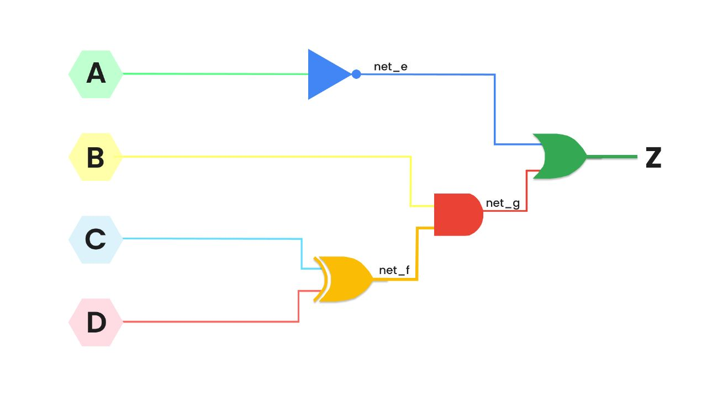

# Circuit Fault Identification Tool

####  An Algorithm designed to identify and analyze faults in manufactured chips or circuits. The tool utilizes an efficient and robust algorithm to detect structural faults at specific nodes in a given circuit.
#### With "CircuitFaultDetect," circuit designers and engineers can easily pinpoint faults in the chip before it is delivered to end users. By identifying these faults in advance, potential issues and failures can be mitigated, ensuring the production of high-quality chips.
<br/>

# Sample Circuit


### Sample Input: 

#### Circuit.txt
```
net_e=~A
net_f=C^D
net_g=B&net_f
Z=net_g|net_e
```

#### Fault:
```
faultNode = net_f
faultType = SA0
```

### Output:
```
[A,B,C,D] = [1,1,0,1], Z=0
```

<br/>

# Getting Started:
## Installation

This algorithm is written in JavaScript and requires the Node.js environment for execution. The Node.js runtime allows you to run JavaScript code outside of a web browser and provides access to additional APIs and modules.

## Prerequisites
Before running the algorithm, ensure that you have the following prerequisites installed:

* Node.js: You can download and install Node.js from the official website (https://nodejs.org). Choose the appropriate version for your operating system and follow the installation instructions.

# To run this project on your local machine, follow these steps:

## Cloning the source code in your local
* Open a terminal or command prompt.

* Change the current working directory to the location where you want to clone the project.

* Run the following command to clone the project repository:
    ```
    git clone https://github.com/your-username/project-name.git
    ```
    Replace your-username with your GitHub username and project-name with the actual name of the project repository.

## Running the Algorithm
To execute the algorithm, follow these steps:

* Open a terminal or command prompt.

* Navigate to the directory where the algorithm code <b>(index.js)</b> is located.
    ```
    cd Circuit-Fault-Identification-Tool
    ```

* Now, run the index.js file using the following command:
    ```
    node index.js
    ```

* The algorithm will now execute, and you should refer <b>output.txt</b> file for result.


## Troubleshooting

If you encounter any issues while running the algorithm, consider the following troubleshooting steps:

* Double-check that Node.js is installed correctly by running node --version in the terminal. It should display the installed version number.

* Check for any error messages or warnings displayed in the terminal, as they can provide valuable insights into the problem.

If the issue persists, you can seek help from relevant online communities or forums specializing in JavaScript or Node.js development. Provide detailed information about the problem and any error messages received for better assistance.

<br/>

# Contact

sinhaanushka2507@gmail.com

[LinkedIn](https://www.linkedin.com/in/anushkasinha25)